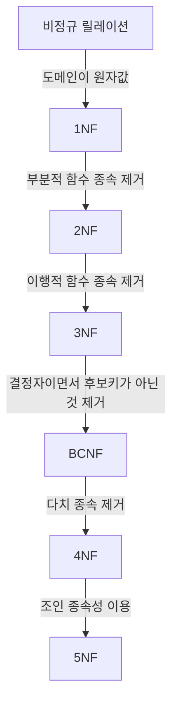

## 정규화의 개념
함수적 종속성 등의 종속성 이론을 이용해, 잘못 설계된 관계형 스키마를 더 작은 속성의 세트로 나누어 바람직한 스키마로 만들어 가는 과정
* 데이터베이스의 개념적 설계 단계와 논리적 설계 단계 사이에서 수행
* 개체들에 존재하는 데이터 속성의 중복을 최소화 → 일치성 보장, [데이터 모델](https://alder-r.github.io/posts/%EB%8D%B0%EC%9D%B4%ED%84%B0-%EB%AA%A8%EB%8D%B8/)을 단순하게 구성
* 개체에 존재하는 함수적 종속 관계를 이용하여 데이터베이스 구조를 안정화
* 논리적 처리 및 품질에 큰 영향을 줌

## 정규화의 과정
**정규형의 종류:** 1NF(제1정규형), 2NF(제2정규형), 3NF(제3정규형), BCNF(Boyce_Codd 정규형), 4NF(제4정규형), 5NF(제5정규형)

## 정규화의 목적
* 어떠한 릴레이션이라도 데이터베이스 내에서 표현 가능하게 만듬
* 효과적인 검색 알고리즘 생성
* 중복을 배제 → [삽입, 삭제, 갱신 이상](#이상(Anomaly)의 개념 및 종류)의 발생 방지
* 자료 저장공간의 최소화 & 데이터 구조의 안정성 최대화
* 데이터베이스 내부 자료의 무결성 유지 극대화

## 이상(Anomaly)의 개념 및 종류
정규화를 거치지 않아 데이터베이스 내 데이터들이 불필요하게 중복 → 릴레이션 조작 시 발생하는 이상 현상
* **삽입 이상(Insertion Anomaly)**: 릴레이션에 데이터를 삽입할 때, 원치 않은 값이 함께 삽입되는 현상
* **삭제 이상(Deletion Anomaly)**: 릴레이션에서 한 튜플을 삭제할 때, 원치 않은 값이 함께 삭제되는 연쇄가 일어나는 현상
* **갱신 이상(Update Anomaly)**: 릴레이션에서 튜플에 있는 속성 값을 갱신할 때, 일부 튜플의 정보만 갱신되어 정보에 모순이 생기는 현상

## 반정규화(Denormalization)
`시스템의 성능 향상, 개발 및 운영의 편의성` 등을 위해 정규화된 데이터 모델을 통합, 중복, 분리하여 의도적으로 정규화 원칙을 위배하는 행위