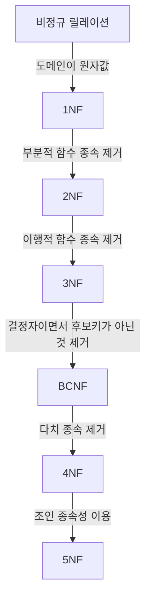

## 정규화의 개념
함수적 종속성 등의 종속성 이론을 이용해, 잘못 설계된 관계형 스키마를 더 작은 속성의 세트로 나누어 바람직한 스키마로 만들어 가는 과정
* 데이터베이스의 개념적 설계 단계와 논리적 설계 단계 사이에서 수행
* 개체들에 존재하는 데이터 속성의 중복을 최소화 → 일치성 보장, [데이터 모델](https://alder-r.github.io/posts/%EB%8D%B0%EC%9D%B4%ED%84%B0-%EB%AA%A8%EB%8D%B8/)을 단순하게 구성
* 개체에 존재하는 함수적 종속 관계를 이용하여 데이터베이스 구조를 안정화
* 논리적 처리 및 품질에 큰 영향을 줌

## 정규화의 과정
**정규형의 종류:** 1NF(제1정규형), 2NF(제2정규형), 3NF(제3정규형), BCNF(Boyce_Codd 정규형), 4NF(제4정규형), 5NF(제5정규형)

