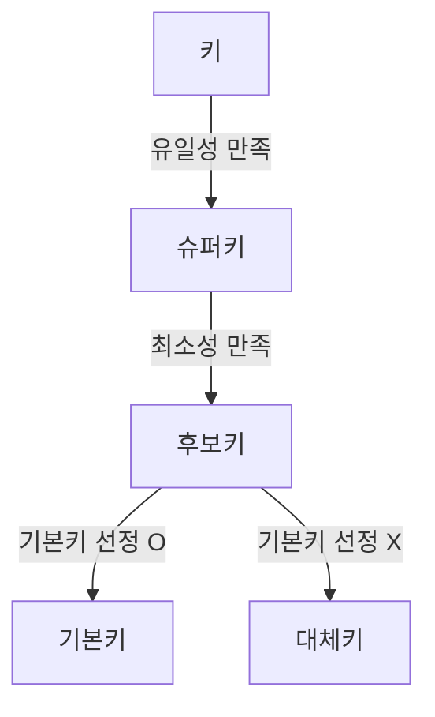

## 키의 개념
키(Key)란 데이터베이스에서 `조건에 맞는 튜플 검색, 순서대로 정렬` 시 기준이 되는 속성(Attribute)

## 키의 종류

|학생 릴레이션|
| 학번  | 이름 | 주민번호       |
| ----- | ---- | -------------- |
| 10101 | 김** | 000101-******* |
| 20202 | 이** | 000202-******* |
| 30303 | 박** | 000303-******* |

|수강 릴레이션|
| 학번  | 과목명     |
| ----- | ---------- |
| 10101 | 프로그래밍 |
| 20202 | 디자인     |
| 30303 | 기획       |

**`유일성`(Unique)**: 하나의 키 값으로 하나의 튜플만을 유일하게 식별할 수 있는 것

**`최소성`(Minimality)**: 키를 구성하는 속성 하나를 제거하면 유일하게 식별할 수 없도록, 최소의 속성으로 구성된 것

**슈퍼키(Super Key)**
* 한 릴레이션 내의 속성들의 집합으로 구성된 키
* 릴레이션을 구성하는 모든 튜플 중 슈퍼키로 구성된 속성의 집합과 동일한 값은 나타나지 않음
* `유일성` 만족
* **예시:** 학생 릴레이션의 `학번`, `주민번호`, `(학번, 주민번호)`, `(학번, 이름, 주민번호)` 등
  * `이름`은 `유일성`을 만족 X(동명이인 가능성)

**후보키(Candidate Key)**
* 릴레이션 내의 속성들 중에서 튜플을 유일하게 식별하기 위해 사용되는 속성들의 부분집합
* 기본키의 후보이기에 후보키
* `유일성`, `최소성` 만족
* **예시:** 학생 릴레이션의 `학번`, `주민등록번호`, 수강 릴레이션의 `(학번, 과목명)`
  * 학생 릴레이션의 `(학번, 주민번호)`, `(학번, 이름, 주민번호)` 등은 `최소성`을 만족 X
  * 수강 릴레이션은 `(학번, 과목명)`을 조합해야만 `유일성`과 `최소성`을 만족

**기본키(Primary Key)**
* 후보키 중에서 선택된 키 → 후보키의 성질을 가짐
* 중복값 X
* NULL값 X
* `유일성`, `최소성` 만족
* * **예시:** 학생 릴레이션의 `학번` 또는 `주민등록번호` 중 선택, 수강 릴레이션의 `(학번, 과목명)`

**대체키(Alternate Key)**
* 기본키를 제외한 나머지 후보키

**외래키(Foreign Key)**
* 다른 릴레이션의 기본키를 참조하는 속성 또는 속성들의 집합
* 릴레이션 간 관계를 표현할 때 사용
* 참조 릴레이션의 기본키와 동일한 키 속성을 가짐

