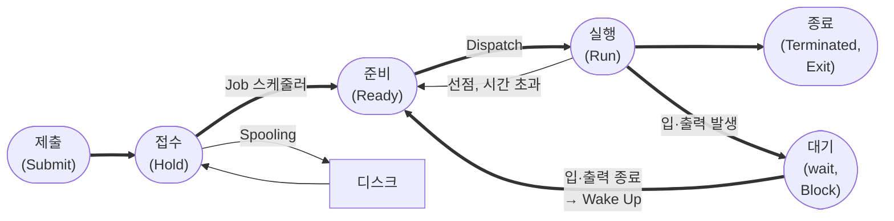

## 프로세스(Process)의 정의
일반적으로 프로세서(처리기, CPU)에 의해 처리되는 사용자 프로그램(실행중인 프로그램)을 의미
* 작업(Job), 태스크(Task)라고도 함
* 다른 정의:
  * 실기억장치에 저장된 프로그램
  * 프로세서가 할당되는 실체
  * 프로시저가 활동중인 것
  * 운영체제가 관리하는 실행 단위
  * 실행중인 프로그램
  * PCB를 가진 프로그램
  * 비동기적 행위를 일으키는 주체
    * 비동기적 행위: 다수의 프로세스가 독립적으로 실행되는 것(규칙적 X, 연속적 X)

## 프로세스 상태 전이
**프로세스 상태 전이**는 프로세스가 시스템 내 존재하는 동안 프로세스의 상태가 변하는 것을 의미

* **Spooling**: 입·출력장치의 공유 및 처리 속도 보완, 다중 프로그래밍 시스템 성능 향상 목적  → 입·출력할 데이터를 바로 보내지 않고, 나중에 한번에 입·출력하기 위해 디스크에 저장하는 과정
* **Dispatch**: 준비 상태에서 대기하던 프로세스 중 하나가 프로세스를 할당받아 실행 상태로 전이되는 과정
* **Wake Up**: 입·출력 작업이 완료되어 프로세스가 대기 상태에서 준비 상태로 전이되는 과정

### 프로세스의 상태
`제출, 접수, 준비, 실행, 대기` 상태로 구분
: 주요 세 가지 상태: `준비, 실행, 대기` 상태
* **제출(Submit)**: 작업을 처리하기 위해 사용자가 작업을 시스템에 제출한 상태
* **접수(Hold)**: 제출된 작업이 스풀 공간인 디스크의 할당 위치에 저장된 상태
* **준비(Ready)**: 프로세스가 CPU를 할당받기 위해 기다리고 있는 상태  → 준비상태 큐에서 실행 준비
  * 준비상태 큐: 여러 프로세스가 CPU를 할당받기 위해 기다리는 장소
* **실행(Run)**: 준비상태 큐에 있는 프로세스가 CPU를 할당받아 실행되는 상태
* **대기(Wait), 보류, 블록(Block)**: 프로세스에 입·출력 필요 시 실행 중인 프로세스 중단, 입·출력가 처리 완료될 때까지 대기하고 있는 상태
* **종료(Terminated, Exit)**: 프로세서의 실행이 끝나고 프로세스 할당이 해제된 상태

## 스케줄링(Scheduling)
프로세스가 생성되어 실행될 때 필요한 시스템의 여러 자원을 해당 프로세스에게 할당하는 작업을 의미 
→ 스케줄링을 수행하는 것을 스케줄러(Scheduler)라고 함
* 

작성 중
