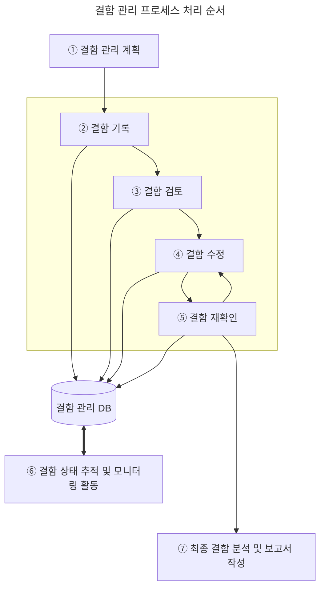

## 결함의 정의
결함(Fault)은 오류 발생, 작동 실패 등과 같이 소프트웨어가 개발자가 설계한 것과 다르게 동작하거나 다른 결과가 발생하는 것
* 일반적인 결함의 판단 기준:
  * 기능 명세서에 명시된 기능이 수행되지 않는 경우
  * 기능 명세서에 명시되지 않았지만 수행되어야 하는 기능이 수행되지 않는 경우
  * 테스트 시각에서 보았을 때 문제가 있다고 판단되는 경우

## 결함 관리 프로세스
[애플리케이션 테스트](https://alder-r.github.io/categories/%EC%95%A0%ED%94%8C%EB%A6%AC%EC%BC%80%EC%9D%B4%EC%85%98-%ED%85%8C%EC%8A%A4%ED%8A%B8-%EC%88%98%ED%96%89/)에서 발견된 결함을 처리하는 것
1. **결함 관리 계획**: 전체 프로세스에 대한 결함 관리 일정, 인력, 업무 프로세스 등을 확보하여 계획을 수립하는 단계
2. **결함 기록**: 테스터가 발견된 결함을 결함 관리 DB에 등록
3. **결함 검토**: 테스터, 프로그램 리더, 품질 관리(QA) 담당자 등이 등록된 결함을 검토 후 결함을 수정할 개발자에게 전달
4. **결함 수정**: 개발자가 전달받은 결함 수정
5. **결함 재확인**: 테스터가 수정한 내용을 확인하고, 다시 테스트 수행
6. **결함 상태 추적 및 모니터링 활동**: 결함 관리 DB를 이용해 프로젝트별 결함 유형, 발생률 등 정보 제공
7. **최종 결함 분석 및 보고서 작성**: 발견된 결함에 대한 정보와 이해관계자들의 의견이 반영된 보고서 작성, 결함 관리 종료

## 결함 상태 추적
* 테스트에서 발견된 결함을 지속적으로 상태 변화 추적, 관리
* 발견된 결함에 대해 결함 관리 측정 지표의 속성 값들을 분석  → 향후 결함이 발견될 모듈, 컴포넌트 추정 가능

### 결함 관리 측정 지표
결함 분포
  : 모듈 또는 컴포넌트의 특정 속성에 해당하는 결함 수 측정

결함 추세
  : 테스트 진행 시간에 따른 결함 수의 추이 분석

결함 에이징
  : 특정 결함 상태로 지속되는 시간 측정

### 결함 상태

|결함 상태|내용|
|---|---|
|Open|결함이 보고만 되고 분석되지 않은 상태|
|Assigned|결함의 영향 분석 및 수정을 위해 개발자에게 결함이 전달된 상태|
|Fixed|개발자에 의해 결함 수정이 완료된 상태|
|Closed|수정된 결함에 대해 테스트를 다시 했을 때 결함이 발견되지 않은 상태|
|Deferred|결함 수정이 연기된 상태|
|Classified|보고된 결함을 관련자들이 확인했을 때 결함이 아니라고 확인된 상태|

## 결함 추적 순서
**결함 추적**: 결함이 발견된 때부터 결함이 해결될 때까지 전 과정을 추적하는 것
1. **결함 등록(Open)**: 테스터와 품질 관리(QA) 담당자에 의해 발견된 결함이 등록된 상태
2. **결함 검토(Reviewed)**: 등록된 결함을 테스터, 품질 관리(QA) 담당자, 프로그램 리더, 담당 모듈 개발자에 의해 검토된 상태
3. **결함 할당(Assigned)**: 결함을 수정하기 위해 개발자와 문제 해결 담당자에게 결함이 할당된 상태
4. **결함 수정(Resolved)**: 개발자가 결함 수정을 완료한 상태
5. **결함 조치 보류(Deferred)**: 결함의 수정이 불가능해 연기된 상태(우선순위, 일정 등에 따라 재등록을 준비중인 상태)
6. **결함 종료(Closed)**: 결함이 해결되어 테스터와 품질 관리(QA) 담당자가 종료를 승인한 상태
7. **결함 해제(Clarified)**: 테스터, 프로그램 리더, 품질 관리(QA) 담당자가 종료 승인한 결함을 검토하여 결함이 아니라고 판명한 상태

## 결함 분류
시스템 결함
  : 시스템 다운, 애플리케이션의 작동 정지, 종료, 응답 시간 지연, 데이터베이스 에러 등 <u>주로 애플리케이션 환경이나 데이터베이스 처리에서 발생된 결함</u>

기능 결함
  : 사용자의 요구사항 미반영/불일치, 부정확한 비즈니스 프로세스, 스크립트 오류, 타 시스템 연동 시 오류 등 <u>애플리케이션의 기획, 설계, 업무 시나리오 등의 단계에서 유입된 결함</u>
  
GUI 결함
  : UI 비일관성, 데이터 타입의 표시 오류, 부정확한 커서/메시지 오류 등 <u>사용자 화면 설계에서 발생된 결함</u>
  
문서 결함
  : 사용자의 요구사항과 기능 요구사항의 불일치로 인한 불완전한 상태의 문서, 사용자의 온라인/오프라인 매뉴얼의 불일치 등 <u>기획자, 사용자, 개발자 간의 의사소통 및 기록이 원활하지 않아 발생된 결함</u>

### 테스트 단계별 유입 결함
* **기획 시 유입되는 결함**: 사용자 요구사항의 표준 미준수로 인한 테스트 불가능, 요구사항 불명확/불완전/불일치 결함 등

* **설계 시 유입되는 결함**: 설계 표준 미준수로 인한 테스트 불가능, 기능 설계 불명확/불완전/불일치 결함 등

* **코딩 시 유입되는 결함**: 코딩 표준 미준수로 인한 기능의 불일치/불완전, 데이터 결함, 인터페이스 결함 등

* **테스트 부족으로 유입되는 결함**: 테스트 수행 시 테스트 완료 기준의 미준수, 테스트팀과 개발팀 간 의사소통 부족, 개발자의 코딩 실수로 인한 결함 등
